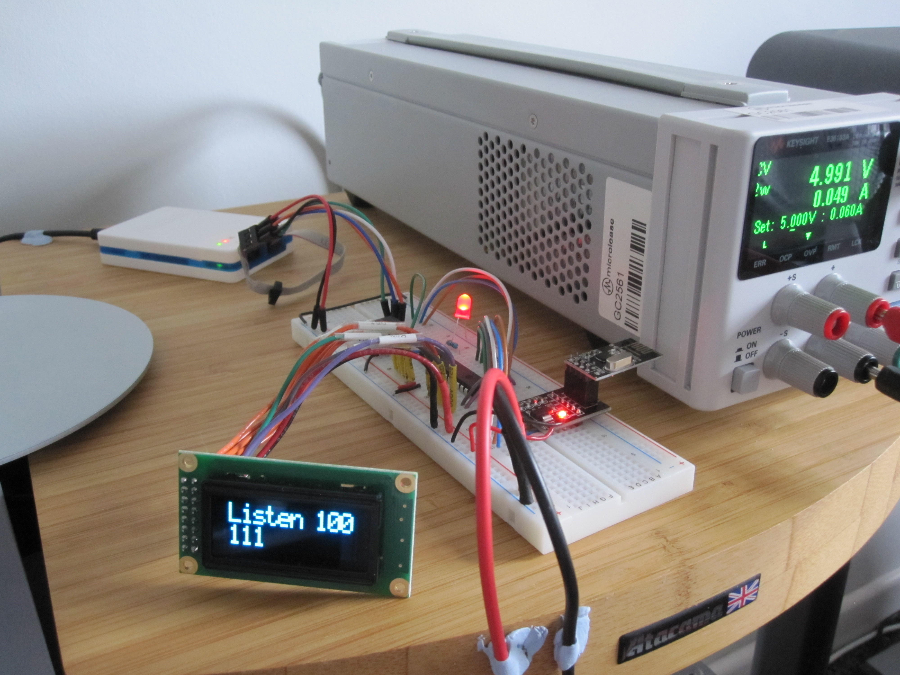

# cgwireless

Atmel Studio C project to send/receive wireless data using the nRF24L01+ module.

For use with the ATMega328P microcontroller and the nRF24L01+ module.
Data can be shown on an OLED display.  

Pinout to the ATMega328P MCU without OLED: -

<pre>
                           ATMega328P                          nRF24L01+
                         ____      ____
                        |    |____|    |
                        | 1         28 | PC5 <----- Button 
                        | 2         27 | PC4 -----> LED
                        | 3         26 | 
                        | 4         25 | 
                        | 5         24 | PC1 ----------------> CSN
                        | 6         23 | PC0 ----------------> CE
                        | 7         22 |
                        | 8         21 |
                        | 9         20 |
                        | 10        19 | PB5 ----------------> SCK
                        | 11        18 | PB4 <---------------- MISO
                        | 12        17 | PB3 ----------------> MOSI
                        | 13        16 | 
                        | 14        15 | 
                        |______________| 
        
 </pre>

Pinout to the ATMega328P MCU with OLED: -

<pre>
  OLED                     ATMega328P                          nRF24L01+
 ______                  ____      ____
       |                |    |____|    |
       |                | 1         28 | PC5 <----- Button 
   DB0 | <--------  PD0 | 2         27 | PC4 -----> LED
   DB1 | <--------  PD1 | 3         26 | 
   DB2 | <--------  PD2 | 4         25 | 
   DB3 | <--------  PD3 | 5         24 | PC1 ----------------> CSN
   DB4 | <--------  PD4 | 6         23 | PC0 ----------------> CE
       |                | 7         22 |
       |                | 8         21 |
       |                | 9         20 |
       |                | 10        19 | PB5 ----------------> SCK
   DB5 | <--------  PD5 | 11        18 | PB4 <---------------- MISO
   DB6 | <--------  PD6 | 12        17 | PB3 ----------------> MOSI
   DB7 | <------->  PD7 | 13        16 | PB2  -----
   EN  | <--------  PB0 | 14        15 | PB1  ---  |
       |                |______________|         | |
       |                                         | |
   RW  | <---------------------------------------  |
   RS  | <----------------------------------------- 
       |
 ______|
 </pre>
 
 nRF24L01+ pinouts are configured in nrf24l01.h
 OLED mappings DB0 to DB7, EN, RW and RS are fully configurable by changing the #define statements in cgoled.h
 
 Buttons use a 1K pull-up resistor on VCC.
 
